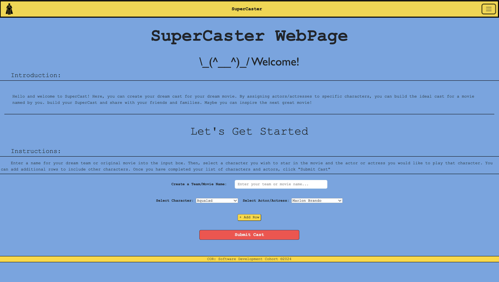
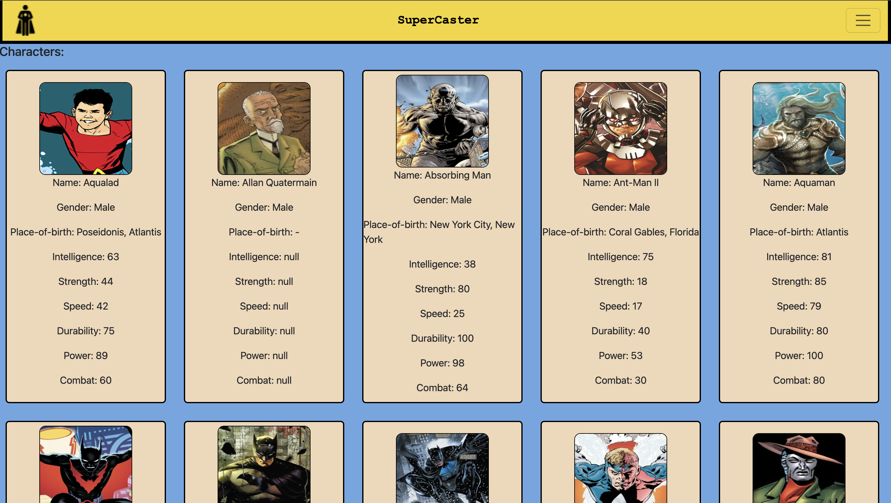
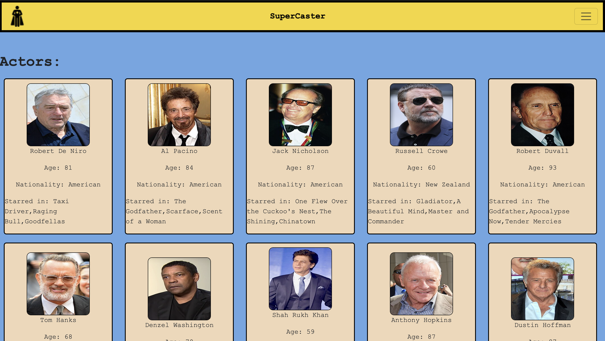
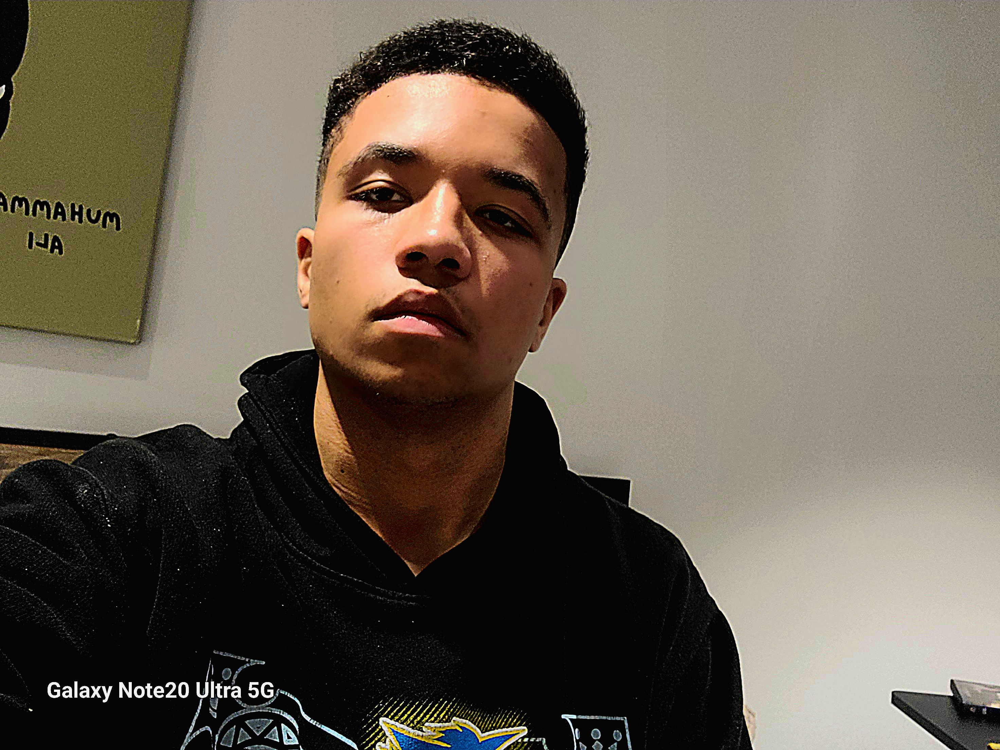

#  SuperCaster

## What is our Project About?
Supercaster is a website where you can create your dream cast for an upcoming movie. Our "Heroes" API gives us information on the heroes available including: name, place of birth, gender, group-affiliation, and images. Our "Actor/Actress" API gives us the name, nationality, birth year, and image. After accessing the information on both hero and actor/actress cards, you can determine if the actor/actress may be suitable to potray the hero in an upcoming movie and cast them. Once you have decided which actor/actress to assign to which character, you can build your cast on the homepage. By creating a team or movie name and selecting your ideal actor and character pairs, you can submit your creation to build your dream cast.

## Technologies
- Bootstrap -
  we used this technology to create our navbar.
- JQuery UI -
  we used this technology to add animation to our welcome message.
- Netlify -
  we used this technology to deploy our webpage.

## Our Webpage
## Home Page
</img>

## Character Page
</img>

## Actor/Actress Page
</img>

## Team Members
## Justin
</img>

## Jordan
</img>

## Marcus
</img>

## Emmanuel
</img>

